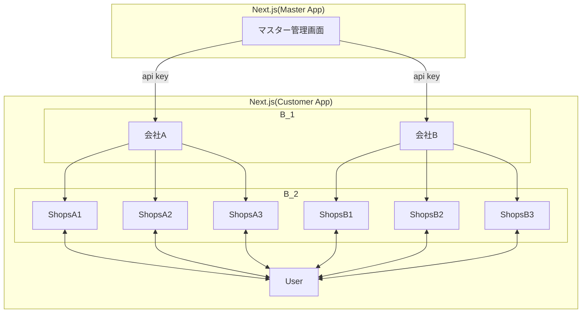

## master2B2B2C 構成 について

$master \to B_1$ と $B_1 \to B_2 \to C$ を分ける。

## Master App

`main`

Customer App

`preview`

`development`

`dev-${feature-name}`

## Customer App

## Auth
`Clerk` 

会社ごとにそれぞれ用意する

## DB
会社ごとにそれぞれを用意する

## Storage
会社ごとにそれぞれを用意する

料金による