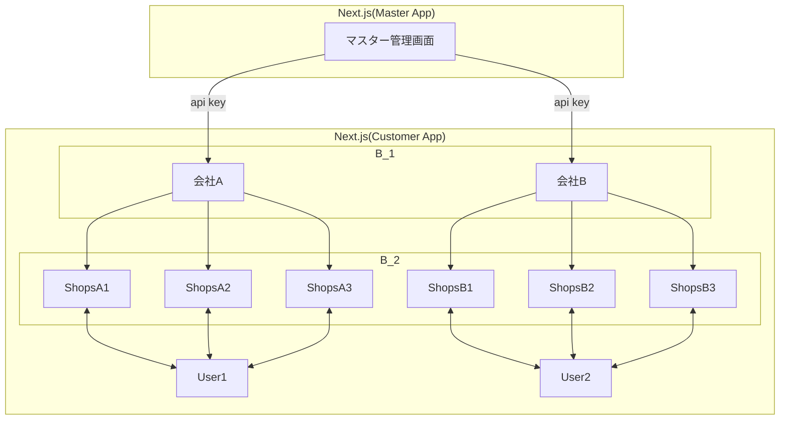

## master2B2B2C 構成 について

$master \to B_1$ と $B_1 \to B_2 \to User$ を分ける。

## Master App

`main`

Customer App

`preview`

`development`

`dev-${feature-name}`

## Customer App

### App

`Vercel` or `AWS`
マルチテナントサービスをホストするための環境があるらしい

サブドメイン環境を使う

https://<会社>.mobipita.com

### Auth
`Clerk` or `Better Auth`

会社ごとにそれぞれ用意する

### DB
`Cloudflare D1` or `AWS RDS ?`
会社ごとにそれぞれを用意する

### Storage
`AWS S3` or `Cloudflare R2`

会社ごとにそれぞれを用意する

料金による

### Payment
`Stripe`: マーケットの運営となるとこっち一択
Stripe Connect というもの で BtoBtoC

`Polar` は自分たちがセラーになること前提の決済サービス

統一環境?

1. Standard Accounts（手軽・Stripe任せ）
    * 特徴: 事業者（B）が自分でStripeアカウントを持ち、あなたのプラットフォームと連携します。
    * メリット: 本人確認やトラブル対応はStripeが直接事業者（B）と行います。開発工数が最も少ないです。
    * 向いている例: Shopifyのようなネットショップ作成サービス、SaaS連携。
2. Express Accounts（バランス型）
    * 特徴: ストライプが提供する簡易的なダッシュボードを、事業者（B）に使わせることができます。
    * メリット: あなたのプラットフォームのブランド感を保ちつつ、口座登録などの面倒なUIはStripeに任せられます。
    * 向いている例: Uber、Lyft、クラウドソーシングサイト。
