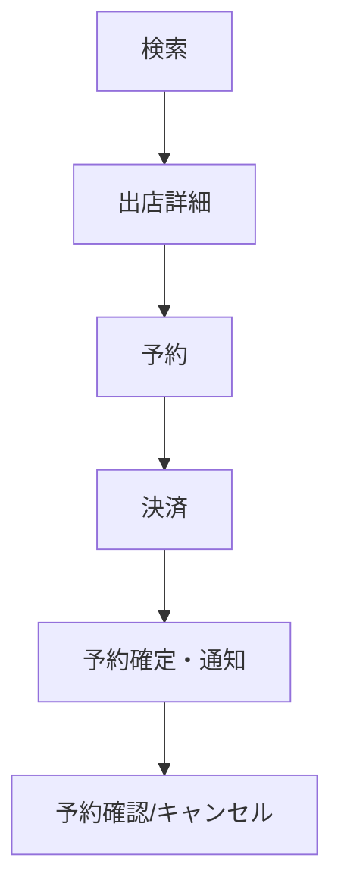

## 概要

このページは顧客向け機能の概要です。詳細は機能単位ページに分割しました。

### 機能単位ページ

- [顧客アカウント](/functional-design/customer/account)
- [検索（出店スケジュール）](/functional-design/customer/search)
- [出店詳細](/functional-design/customer/detail)
- [予約](/functional-design/customer/booking)
- [決済](/functional-design/customer/payment)
- [予約確認・変更・キャンセル](/functional-design/customer/manage-booking)

---

## 全体フロー（たたき台）

