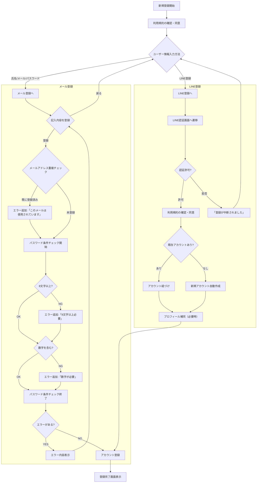
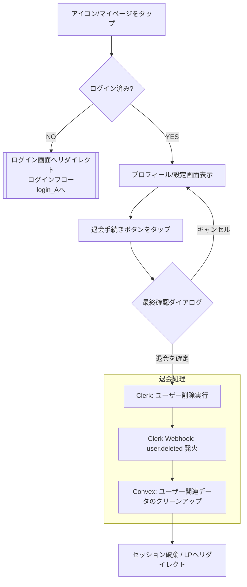
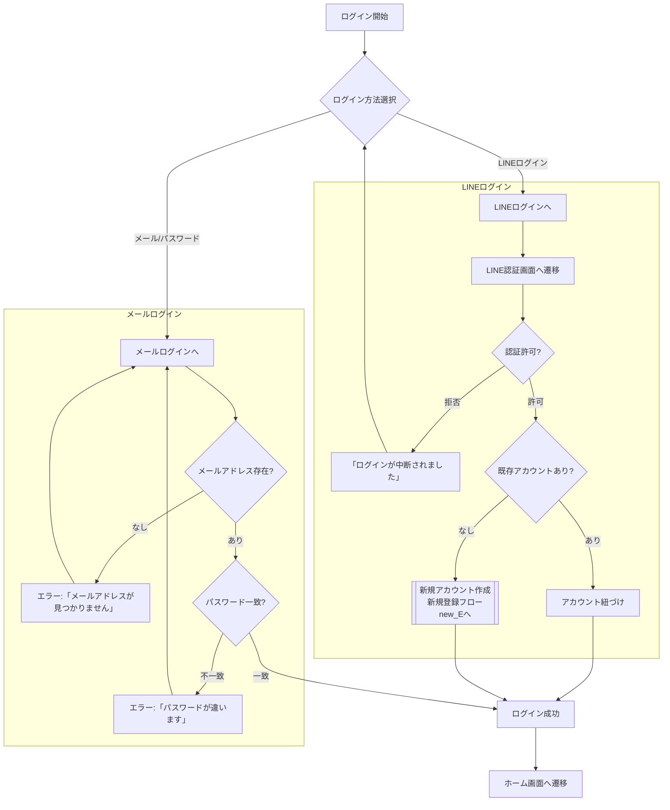
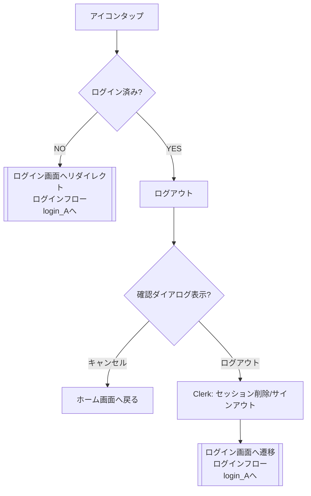
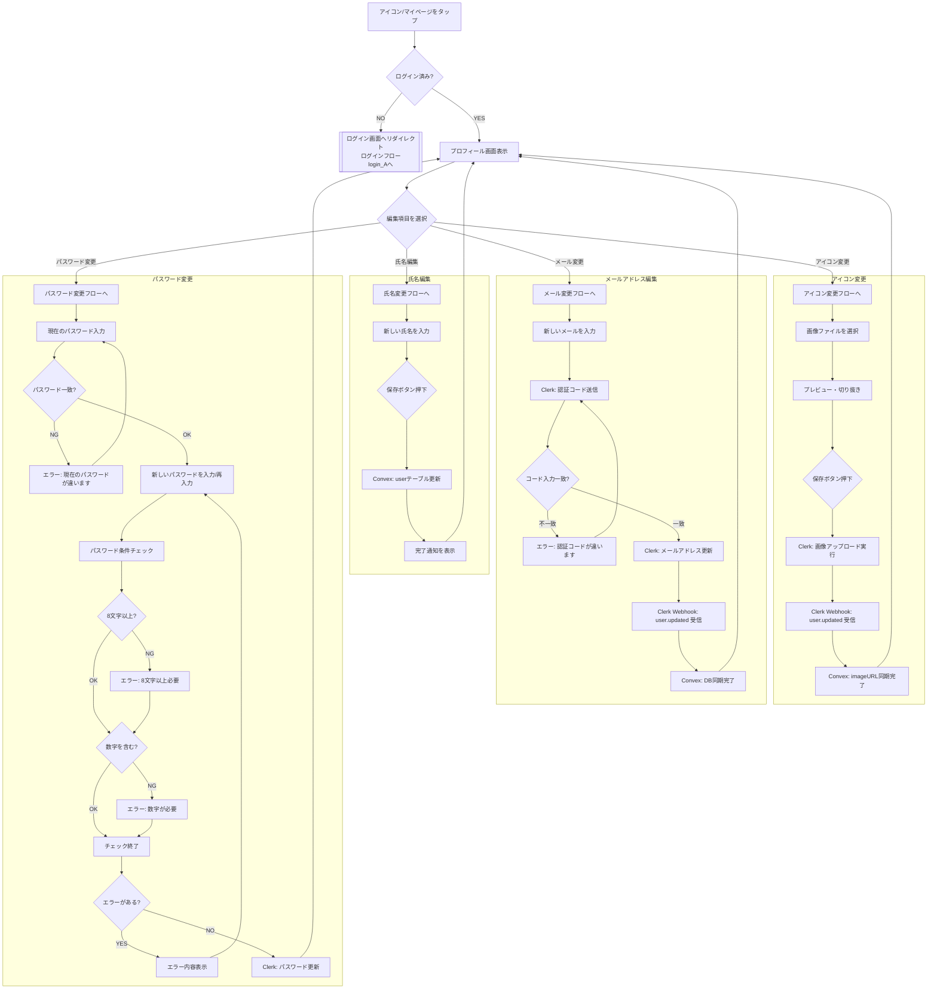

---

title: 顧客アカウント
description: 新規登録/退会、ログイン、プロフィール編集
---

## 機能

- 新規登録/退会
  - 氏名、メールアドレス、パスワードもしくは、LINEアカウントで登録
  - 利用規約への同意
  - パスワード生成条件（詳細は要定義）
- ログイン/ログアウト
- プロフィール編集（ログイン必須）
  - 氏名
  - メールアドレス
  - パスワード
  - アイコン

##  確認事項
- 新規登録
  - LINE上でも利用規約が必要か
  - パスワードの生成条件はどうするか
- 退会
  - 退会のフローでは技術スタックの情報も含めて書いているがどちらの書き方が好ましいか
  - プロフィールのアイコンをタップして、退会とプロフィール編集のボタンを表示させる形でよいか
---

## フロー（たたき台）

## 新規登録フロー 
　

## 退会

## ログイン

## ログアウト

## プロフィール編集

