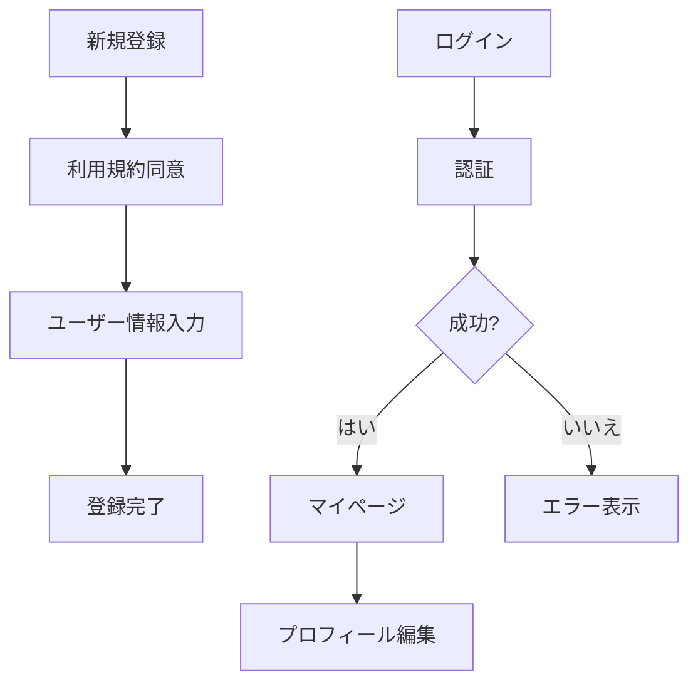

## 機能

- 新規登録/退会
  - 氏名、メールアドレス、パスワードなどを登録
  - 利用規約への同意
  - パスワード生成条件（詳細は要定義）
- ログイン/ログアウト
- プロフィール編集（ログイン必須）

---

## フロー（たたき台）

```mermaid
flowchart TD
  A[新規登録] --> B[利用規約同意]
  B --> C[ユーザー情報入力]
  C --> D[登録完了]
  E[ログイン] --> F[認証]
  F --> G{成功?}
  G -- はい --> H[マイページ]
  G -- いいえ --> I[エラー表示]
  H --> J[プロフィール編集]
```

