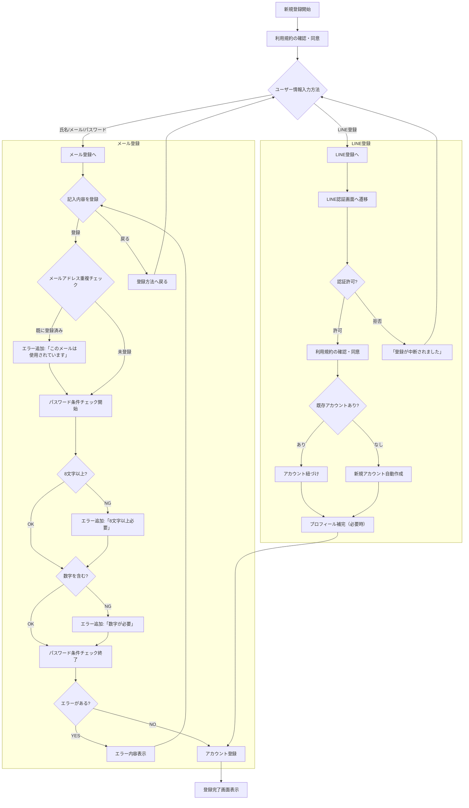

---

title: 顧客アカウント
description: 新規登録/退会、ログイン、プロフィール編集
---

## 機能

- 新規登録/退会
  - 氏名、メールアドレス、パスワードもしくは、LINEアカウントで登録
  - 利用規約への同意
  - パスワード生成条件（詳細は要定義）
- ログイン/ログアウト
- プロフィール編集（ログイン必須）

##  疑問点
- LINE上でも利用規約が必要か
- パスワードの生成条件はどうするか
---

## フロー（たたき台）

