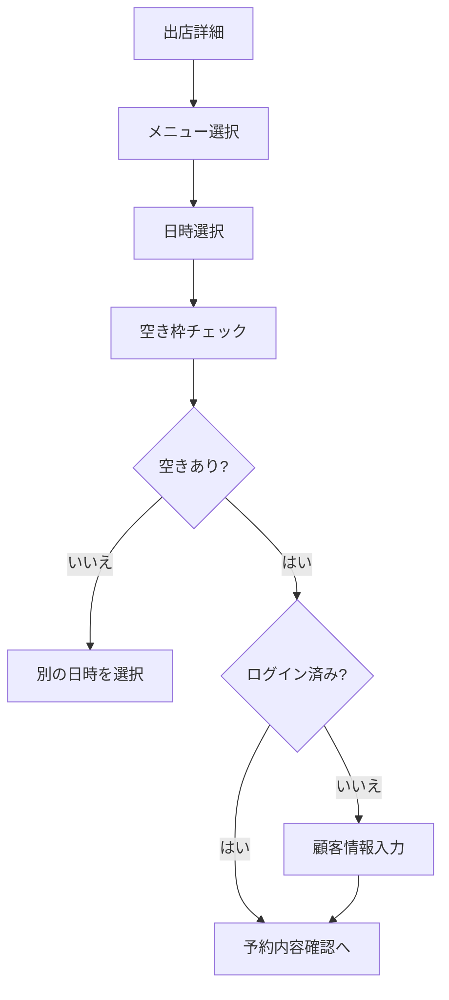

## 機能

- メニュー/セットの選択（例：Aセット60分、Bセット90分）
- 希望日時（開始時刻）の選択
  - メニュー所要時間に必要なスロット群の空きを自動チェック
- 顧客情報入力（ログイン時は省略可）
  - 氏名、メールアドレス、電話番号
  - 利用人数または組数
  - 備考（任意）

---

## フロー（たたき台）

```mermaid
flowchart TD
  A[出店詳細] --> B[メニュー選択]
  B --> C[日時選択]
  C --> D[空き枠チェック]
  D --> E{空きあり?}
  E -- いいえ --> F[別の日時を選択]
  E -- はい --> G{ログイン済み?}
  G -- はい --> H[予約内容確認へ]
  G -- いいえ --> I[顧客情報入力]
  I --> H
```

