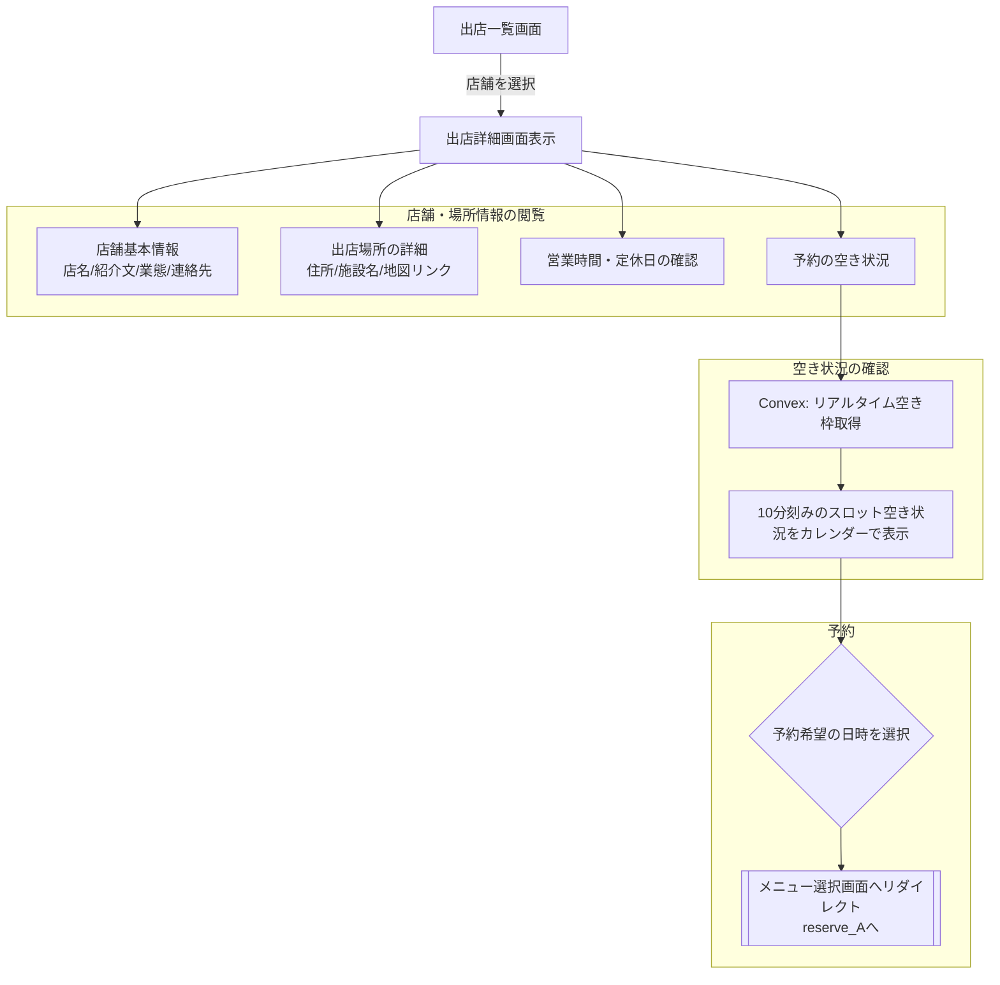

## 表示内容

- 店舗情報（店舗名、紹介文、業態、連絡先など）
- 出店場所（住所、施設名、地図リンク）
- 営業時間・予約可能な時間帯
- 予約枠の空き状況

---

## フロー（たたき台）

```mermaid
flowchart TD

shop_A[出店一覧画面] -->|店舗を選択| shop_B[出店詳細画面表示]

subgraph shop_info [店舗・場所情報の閲覧]
    shop_C[店舗基本情報<br/>店名/紹介文/業態/連絡先]
    shop_D[出店場所の詳細<br/>住所/施設名/地図リンク]
    shop_E[営業時間・定休日の確認]
    shop_K[予約の空き状況]
end

shop_B --> shop_C
shop_B --> shop_D
shop_B --> shop_E
shop_B --> shop_K

subgraph shop_status [空き状況の確認]
    shop_F[Convex: リアルタイム空き枠取得]
    
    shop_H[10分刻みのスロット空き状況をカレンダーで表示]
end
shop_K --> shop_F
shop_F -->  shop_H

subgraph shop_action [予約]
    shop_I{予約希望の日時を選択}
    shop_J[[メニュー選択画面へリダイレクト<br/>reserve_Aへ]]
end

shop_H --> shop_I
shop_I --> shop_J
```

