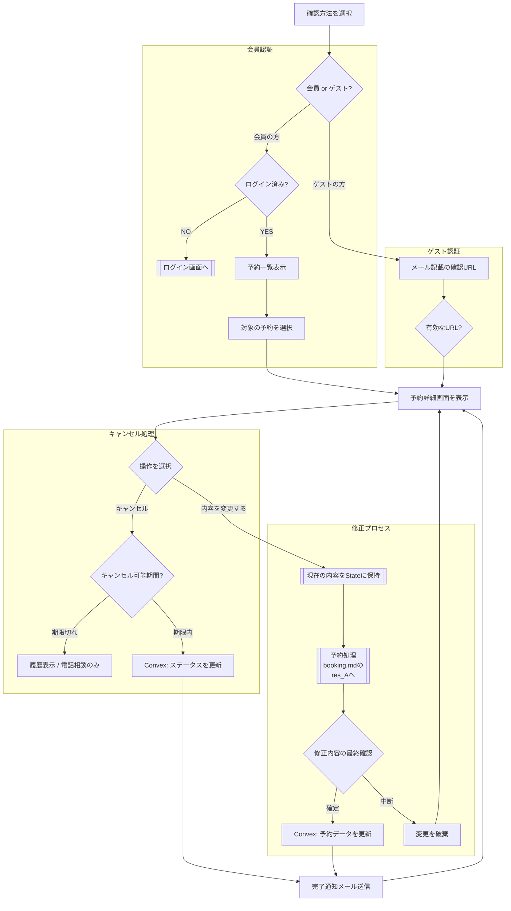

## 機能

- 予約完了メール（予約番号、日時、場所、メニュー、金額など）
- 会員/ゲスト予約に対応
  - 会員: マイページから予約一覧表示、キャンセル処理
  - ゲスト: メール内リンクから予約確認・キャンセル
- キャンセル可能期限・返金有無は本部のキャンセルポリシーに準拠

---

## フロー（たたき台）

```mermaid
flowchart TD

%% --- 1. 入り口と認証 ---
entry_A[確認方法を選択] --> entry_B{会員 or ゲスト?}

subgraph member_logic [会員認証]
    entry_B -->|会員の方| member_auth{ログイン済み?}
    member_auth -->|NO| member_login[[ログイン画面へ]]
    member_auth -->|YES| member_list[予約一覧表示]
    member_list --> member_select[対象の予約を選択]
end

subgraph guest_logic [ゲスト認証]
    entry_B -->|ゲストの方| guest_A[メール記載の確認URL]
    guest_A --> guest_B{有効なURL?}
end

member_select & guest_B --> common_view[予約詳細画面を表示]

%% --- 2. 予約詳細からのアクション分岐 ---
common_view --> action_check{操作を選択}

%% --- 3. キャンセルルート ---
subgraph cancel_logic [キャンセル処理]
    action_check -->|キャンセル| check_A{キャンセル可能期間?}
    check_A -->|期限切れ| cancel_limit[履歴表示 / 電話相談のみ]
    check_A -->|期限内| cancel_exec[Convex: ステータスを更新]
end

%% --- 4. 予約修正ルート（booking.md のロジックを再利用） ---
action_check -->|内容を変更する| edit_init[[現在の内容をStateに保持]]

subgraph edit_subroutine [修正プロセス]
    edit_init --> booking_logic[[予約処理<br>booking.mdの<br>res_Aへ]]
    
    %% 修正特有のバリデーション
    booking_logic --> edit_verify{修正内容の最終確認}
    edit_verify -->|確定| edit_save[Convex: 予約データを更新]
    edit_verify -->|中断| edit_rollback[変更を破棄]
end

%% --- 5. 完了・戻り導線 ---
cancel_exec --> mail[完了通知メール送信]
edit_rollback --> common_view
edit_save --> mail[完了通知メール送信]
mail --> common_view

```

