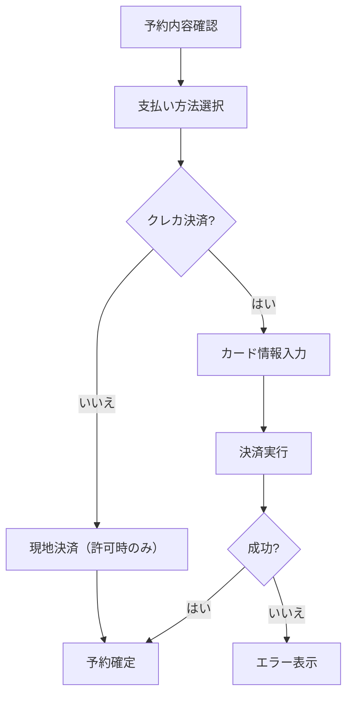

## 機能

- クレジットカード情報入力
- 予約内容の確認画面表示
- 決済完了後、予約確定
- 現地決済の可否は店舗・本部設定に準拠

---

## フロー（たたき台）

```mermaid
flowchart TD
  A[予約内容確認] --> B[支払い方法選択]
  B --> C{クレカ決済?}
  C -- はい --> D[カード情報入力]
  D --> E[決済実行]
  E --> F{成功?}
  F -- はい --> G[予約確定]
  F -- いいえ --> H[エラー表示]
  C -- いいえ --> I[現地決済（許可時のみ）]
  I --> G
```

