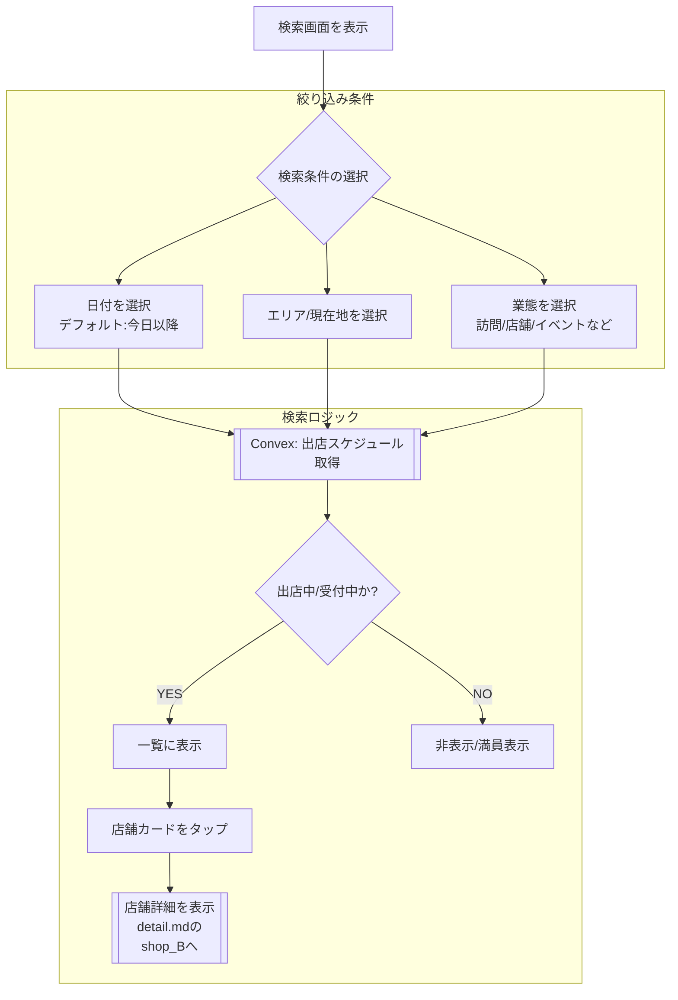

## 機能

- 日付・エリア・業態（訪問/店舗など）で絞り込み
- 出店一覧表示
  - 店舗名、出店場所、時間帯、予約可否

---

## フロー（たたき台）

```mermaid
flowchart TD

%% 1. 検索条件入力
search_start[検索画面を表示] --> filter_input{検索条件の選択}

subgraph filters [絞り込み条件]
    filter_input --> date_select[日付を選択<br/>デフォルト:今日以降]
    filter_input --> area_select[エリア/現在地を選択]
    filter_input --> category_select[業態を選択<br/>訪問/店舗/イベントなど]
end

%% 2. データ取得ロジック
date_select & area_select & category_select --> search_exec[[Convex: 出店スケジュール取得]]

subgraph logic [検索ロジック]
    search_exec --> check_active{出店中/受付中か?}
    check_active -->|YES| result_list[一覧に表示]
    check_active -->|NO| result_hide[非表示/満員表示]

result_list --> tap_list[店舗カードをタップ]
tap_list --> view_card[[店舗詳細を表示<br>detail.mdの<br>shop_Bへ]]
end

```

