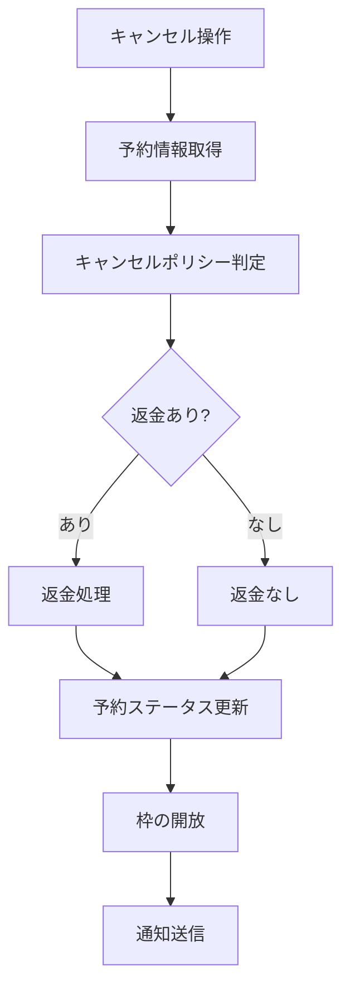

```mermaid
flowchart TD
  A[キャンセル操作] --> B[予約情報取得]
  B --> C[キャンセルポリシー判定]
  C --> D{返金あり?}
  D -- あり --> E[返金処理]
  D -- なし --> F[返金なし]
  E --> G[予約ステータス更新]
  F --> G
  G --> H[枠の開放]
  H --> I[通知送信]
```

