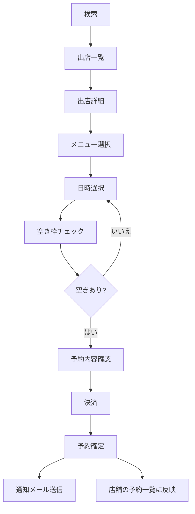

```mermaid
flowchart TD
  A[検索] --> B[出店一覧]
  B --> C[出店詳細]
  C --> D[メニュー選択]
  D --> E[日時選択]
  E --> F[空き枠チェック]
  F --> G{空きあり?}
  G -- いいえ --> E
  G -- はい --> H[予約内容確認]
  H --> I[決済]
  I --> J[予約確定]
  J --> K[通知メール送信]
  J --> L[店舗の予約一覧に反映]
```

