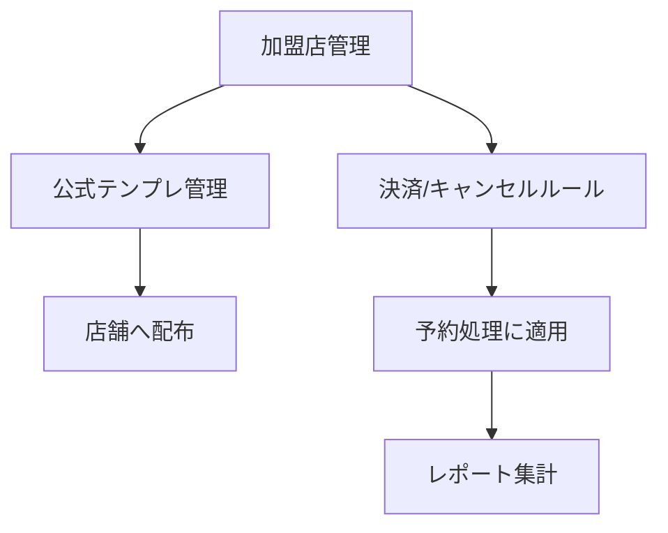

## 概要

このページは本部向け機能の概要です。詳細は機能単位ページに分割しました。

### 機能単位ページ

- [加盟店管理](/functional-design/headquarters/franchise-stores)
- [キャンセルポリシー・決済ルール管理](/functional-design/headquarters/policies-payments)
- [テンプレート管理（公式テンプレ）](/functional-design/headquarters/templates)
- [本部向けレポート](/functional-design/headquarters/reports)

---

## 全体フロー（たたき台）

