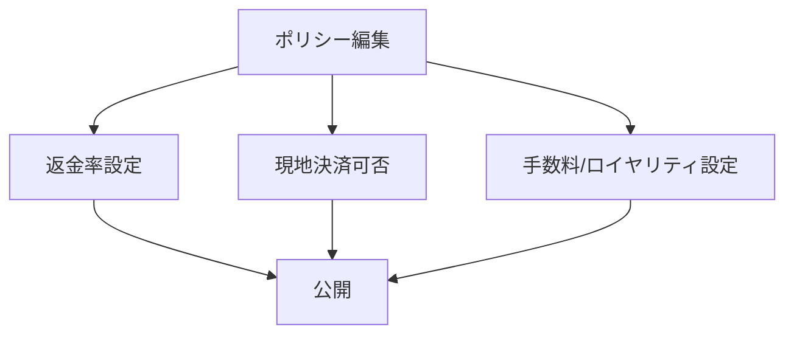

## 機能

- キャンセルタイミング別の返金率設定
- 現地決済の許可可否（店舗単位/業態単位）
- 決済手数料・ロイヤリティ算定用の基本ルール設定

---

## フロー（たたき台）

```mermaid
flowchart TD
  A[ポリシー編集] --> B[返金率設定]
  A --> C[現地決済可否]
  A --> D[手数料/ロイヤリティ設定]
  B --> E[公開]
  C --> E
  D --> E
```

