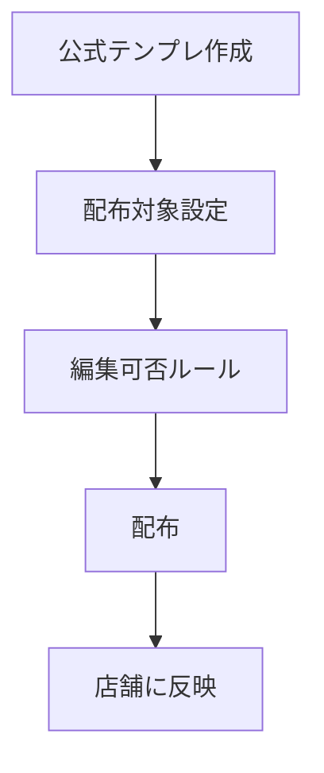

## 機能

- 業態別/曜日別/場所別の公式テンプレート作成
- 配布対象店舗（全体/エリア/形態）設定
- 店舗側での編集可否ルール設定（参照のみ/コピーして編集可）

---

## フロー（たたき台）

```mermaid
flowchart TD
  A[公式テンプレ作成] --> B[配布対象設定]
  B --> C[編集可否ルール]
  C --> D[配布]
  D --> E[店舗に反映]
```

