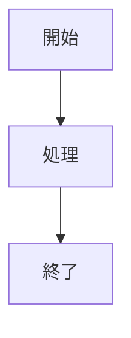

## 目的

- 機能設計を「役割（顧客/店舗/本部）」と「機能単位」に分割して、読みやすく・追記しやすくします。
- 各ページに `mermaid` のフローチャート枠を用意し、業務フローの追記をしやすくします。

---

## 目次

- **システム**
  - [システム全体構成（概要）](/functional-design/system-architecture)
  - [構成要素](/functional-design/system/components)
  - [外部サービス連携](/functional-design/system/external-integrations)
- **顧客**
  - [顧客向け（概要）](/functional-design/customer-features)
  - [アカウント](/functional-design/customer/account)
  - [検索](/functional-design/customer/search)
  - [出店詳細](/functional-design/customer/detail)
  - [予約](/functional-design/customer/booking)
  - [決済](/functional-design/customer/payment)
  - [予約確認・変更・キャンセル](/functional-design/customer/manage-booking)
- **店舗**
  - [店舗向け（概要）](/functional-design/store-features)
  - [店舗アカウント](/functional-design/store/account)
  - [出店スケジュール（カレンダー）](/functional-design/store/schedule)
  - [テンプレートから作成](/functional-design/store/templates)
  - [予約枠・メニュー設定](/functional-design/store/menu-slots)
  - [予約一覧・当日運営](/functional-design/store/ops)
  - [店舗レポート](/functional-design/store/reports)
- **本部**
  - [本部向け（概要）](/functional-design/headquarters-features)
  - [加盟店管理](/functional-design/headquarters/franchise-stores)
  - [キャンセルポリシー・決済ルール](/functional-design/headquarters/policies-payments)
  - [公式テンプレート管理](/functional-design/headquarters/templates)
  - [本部レポート](/functional-design/headquarters/reports)
- **フロー（横断）**
  - [フロー一覧](/functional-design/flows/)
  - [予約フロー](/functional-design/flows/reservation-flow)
  - [キャンセル・返金フロー](/functional-design/flows/cancel-refund-flow)
  - [出店スケジュール作成フロー](/functional-design/flows/store-schedule-flow)
  - [テンプレ配布フロー](/functional-design/flows/template-distribution-flow)

---

## フローチャート（Mermaid）記法

