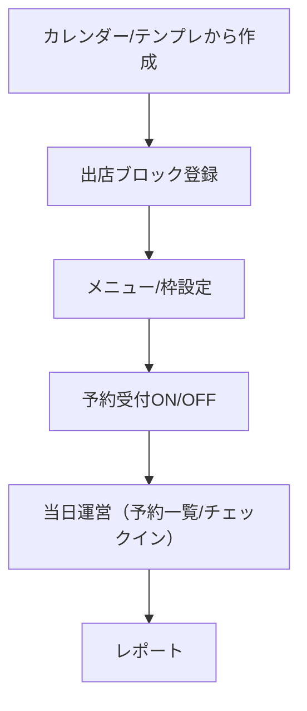

## 概要

このページは店舗向け機能の概要です。詳細は機能単位ページに分割しました。

### 機能単位ページ

- [店舗アカウント](/functional-design/store/account)
- [出店スケジュール管理（カレンダー）](/functional-design/store/schedule)
- [テンプレートからのスケジュール作成](/functional-design/store/templates)
- [予約枠・メニュー設定](/functional-design/store/menu-slots)
- [予約一覧・当日運営](/functional-design/store/ops)
- [店舗向けレポート（簡易版）](/functional-design/store/reports)

---

## 全体フロー（たたき台）

