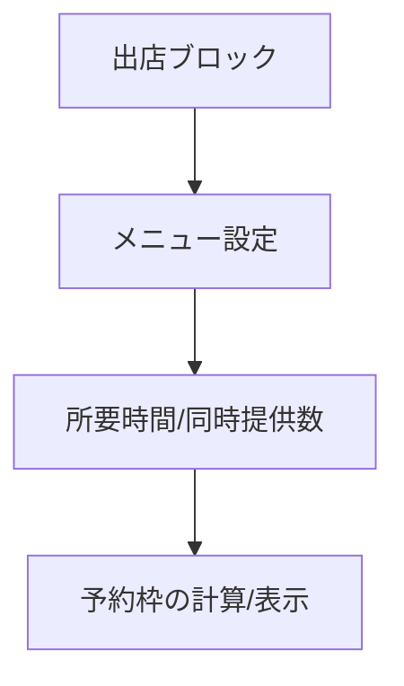

## 機能

- 出店ブロックごとの予約枠管理
- メニューごとの設定
  - 所要時間（分）
  - 同時提供可能数（同時間帯に対応できる件数）
- スロット空き状況の確認

---

## フロー（たたき台）

```mermaid
flowchart TD
  A[出店ブロック] --> B[メニュー設定]
  B --> C[所要時間/同時提供数]
  C --> D[予約枠の計算/表示]
```

