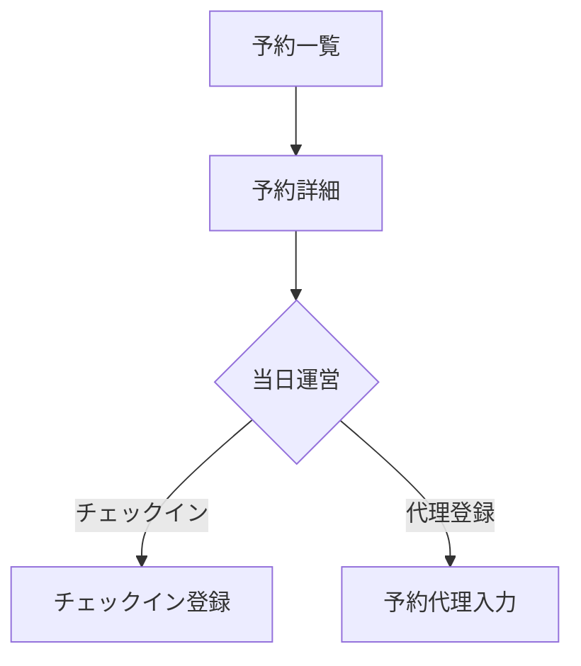

## 機能

- 日付・場所ごとの予約一覧表示（時刻、顧客名、人数/組数、メニュー、備考、決済ステータスなど）
- 来店/訪問時のチェックイン管理（オプション）
- 店舗側からの予約代理登録（電話受付分の入力など）

---

## フロー（たたき台）

```mermaid
flowchart TD
  A[予約一覧] --> B[予約詳細]
  B --> C{当日運営}
  C -- チェックイン --> D[チェックイン登録]
  C -- 代理登録 --> E[予約代理入力]
```

