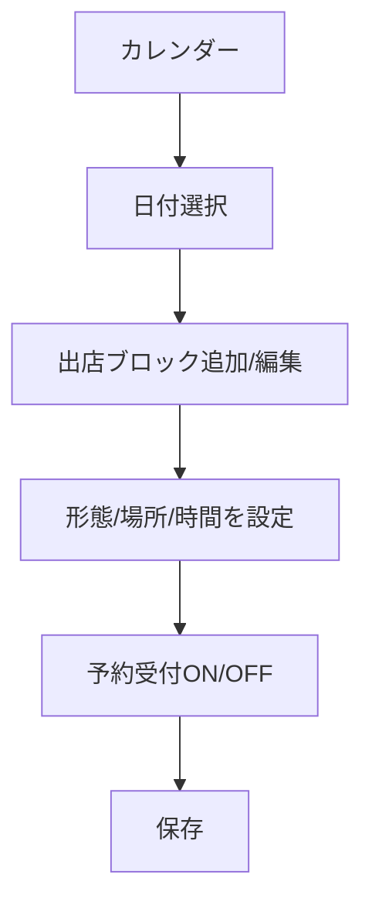

## 機能

- 月/週/日単位のカレンダー表示
- 日付を選択して出店日の編集画面を開く
- 出店時間ブロックの登録（例：10:00-12:00 @〇〇スーパー）
- 出店形態
  - 固定出店
  - 訪問型（対応エリアを設定）
- 10分スロット単位で上限設定（人数/組数）
- 予約受付の有無（ON/OFF）切り替え

---

## フロー（たたき台）

```mermaid
flowchart TD
  A[カレンダー] --> B[日付選択]
  B --> C[出店ブロック追加/編集]
  C --> D[形態/場所/時間を設定]
  D --> E[予約受付ON/OFF]
  E --> F[保存]
```

