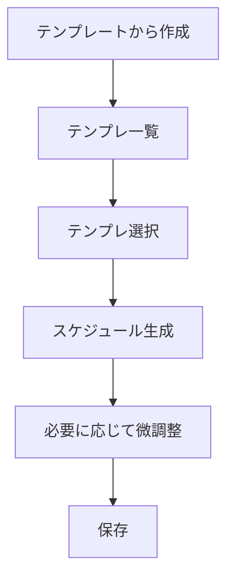

## 機能

- 「テンプレートから作成」を選択
- 利用可能テンプレート一覧から選択
  - 本部公式テンプレート
  - 自店舗独自テンプレート
- 適用後、当日だけ時間・場所・メニューなどの微調整が可能

---

## フロー（たたき台）

```mermaid
flowchart TD
  A[テンプレートから作成] --> B[テンプレ一覧]
  B --> C[テンプレ選択]
  C --> D[スケジュール生成]
  D --> E[必要に応じて微調整]
  E --> F[保存]
```

