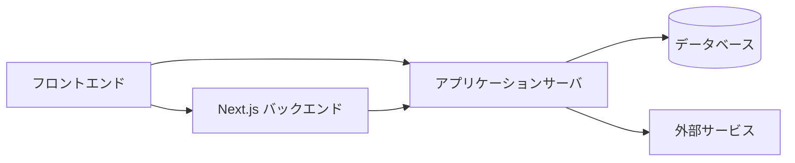

## 詳細ページ

- [構成要素](/functional-design/system/components)
- [外部サービス連携](/functional-design/system/external-integrations)

---

## 構成イメージ（たたき台）

## 構成イメージ（論理構成）

1. フロントエンド（Web アプリケーション）
   - 顧客向け予約画面
   - 店舗向け管理画面（カレンダー・予約一覧 等）
   - 本部向け管理画面（テンプレート管理・店舗管理 等）
   - PC／スマートフォン双方からの利用を想定

2. アプリケーションサーバ
   - ユーザー認証・権限管理
   - 予約・出店スケジュール管理ロジック
   - テンプレート管理機能
   - キャンセルポリシー・決済ルール適用ロジック
   - メール／通知送信処理

3. データベースサーバ
   - ユーザー情報（顧客／店舗／本部）
   - 店舗情報・出店場所情報
   - 出店スケジュール・予約枠・予約データ
   - メニュー・所要時間・同時提供数など
   - テンプレート情報
   - ログ・監査情報

4. 外部サービス連携
   - オンライン決済サービス（クレジットカード決済）
   - 地図サービス（出店場所の地図リンク表示）
   - メール送信サービス（予約完了通知 等）

:::note
インフラ構成（クラウド種別、冗長構成 等）は、別途インフラ設計にて詳細化。
:::
