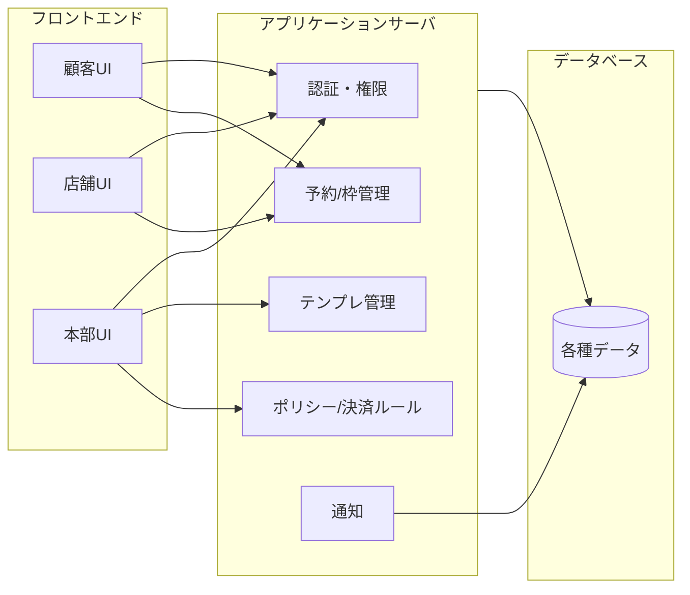

## 構成

### フロントエンド（Webアプリ）

- 顧客向け予約画面
- 店舗向け管理画面（カレンダー・予約一覧など）
- 本部向け管理画面（テンプレート管理・店舗管理など）
- PC/スマートフォン双方を想定

### アプリケーションサーバ

- ユーザー認証・権限管理
- 予約・出店スケジュール管理ロジック
- テンプレート管理
- キャンセルポリシー・決済ルール適用
- メール/通知送信

### データベース

- ユーザー情報（顧客/店舗/本部）
- 店舗情報・出店場所情報
- 出店スケジュール・予約枠・予約データ
- メニュー（所要時間、同時提供数など）
- テンプレート情報
- ログ・監査情報

---

## 画面と責務の切り分け（たたき台）

