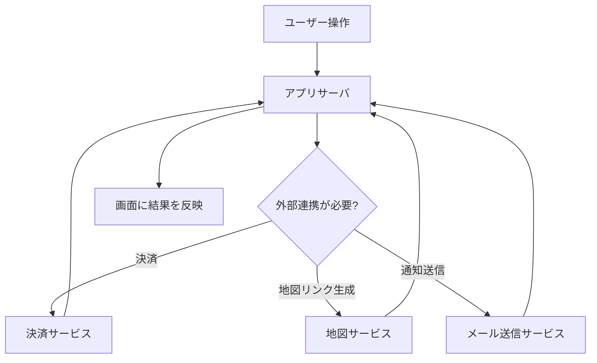

## 対象

- オンライン決済（クレジットカード決済）
- 地図サービス（出店場所の地図リンク表示）
- メール送信サービス（予約完了通知など）

---

## 連携フロー（たたき台）

```mermaid
flowchart TD
  A[ユーザー操作] --> B[アプリサーバ]
  B --> C{外部連携が必要?}
  C -- 決済 --> P[決済サービス]
  C -- 地図リンク生成 --> M[地図サービス]
  C -- 通知送信 --> E[メール送信サービス]
  P --> B
  M --> B
  E --> B
  B --> D[画面に結果を反映]
```

:::note
インフラ構成（クラウド種別、冗長構成など）は別途インフラ設計で詳細化します。
:::

