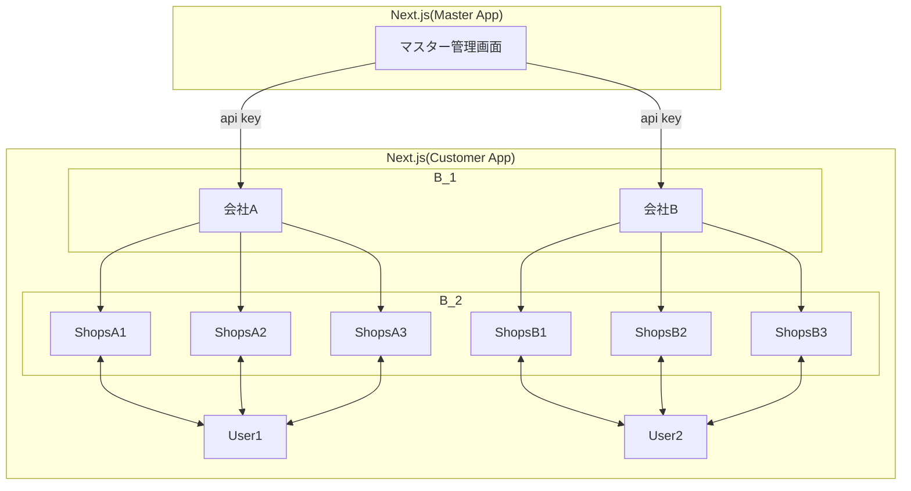

:::caution[作業中]
このドキュメントは現在**作業中**です。アプリケーション構成は検討段階であり、実装前に変更される可能性があります。
:::

## master2B2B2C 構成について

MobiPitaでは、マスター管理機能と顧客向け機能を分離した構成を検討しています。

$master \to B_1$ と $B_1 \to B_2 \to User$ を分ける。

## Master App

**ブランチ**: `main`

マスター管理画面（RootTenant向け）を提供するアプリケーションです。

- RootTenant（本部）向けの管理機能
- テナント管理、設定の一元管理
- 全体のレポート・分析機能

:::tip[検討中]
Master Appの具体的な機能範囲や実装方法は検討中です。
:::

## Customer App

**ブランチ**: `preview`, `development`, `dev-${feature-name}`

B2B2Cの各レイヤー（RootTenant → Tenant → Location → User）向けのアプリケーションです。

- サブドメインによるマルチテナント構成
- 各テナントごとの独立した環境

## Customer App の技術スタック（検討中）

### App（ホスティング）

**候補**: `Vercel` or `AWS`

マルチテナントサービスをホストするための環境が必要です。

**サブドメイン環境を使用**:
- `https://<会社>.mobipita.com` の形式
- 各テナントごとに独立したサブドメインを割り当て

:::tip[検討中]
初期はVercelで開始し、成長に合わせてAWSへ移行する戦略を検討中です。
詳細は[インフラ選定](/research/infrastructure-selection)を参照してください。
:::

### Auth（認証）

**候補**: `Clerk` or `Better Auth`

**検討事項**:
- 会社ごとにそれぞれ用意するか、統一環境か
- マルチテナント対応の実装方法

:::tip[検討中]
認証プロバイダーの選定と、マルチテナント対応の実装方法は検討中です。
:::

### DB（データベース）

**候補**: `Cloudflare D1` or `AWS RDS` (PostgreSQL)

**検討事項**:
- 会社ごとにそれぞれを用意するか、共有DBでテナント分離するか
- マルチテナントDBの設計パターン（RLS vs Schema分離）

:::tip[検討中]
データベース設計の詳細は[データベース設計](/architecture/db/database-design)を参照してください。
:::

### Storage（ストレージ）

**候補**: `AWS S3` or `Cloudflare R2`

**検討事項**:
- 会社ごとにそれぞれを用意するか、統一バケットでプレフィックス分離するか
- 料金による選定

:::tip[検討中]
ストレージの分離方法と料金比較は検討中です。
:::

### Payment（決済）

**選定**: `Stripe`（マーケットの運営となるとこっち一択）

**Stripe Connect** を使用してB2B2Cを実現します。

**検討除外**: `Polar` - 自分たちがセラーになること前提の決済サービスのため、今回は不採用

**Stripe Connect のアカウントタイプ（検討中）**:

1. **Standard Accounts**（手軽・Stripe任せ）
   - 特徴: 事業者（B）が自分でStripeアカウントを持ち、プラットフォームと連携します。
   - メリット: 本人確認やトラブル対応はStripeが直接事業者（B）と行います。開発工数が最も少ないです。
   - 向いている例: Shopifyのようなネットショップ作成サービス、SaaS連携。

2. **Express Accounts**（バランス型）
   - 特徴: Stripeが提供する簡易的なダッシュボードを、事業者（B）に提供できます。
   - メリット: プラットフォームのブランド感を保ちつつ、口座登録などの面倒なUIはStripeに任せられます。
   - 向いている例: Uber、Lyft、クラウドソーシングサイト。

3. **Custom Accounts**（完全制御）
   - 特徴: オンボーディング、管理画面、レポートをすべてプラットフォーム側で実装する代わりにコントロールは最大、責任も最大
   - メリット: ブランド統一性が最も高い
   - デメリット: 開発工数が最も多い

:::tip[検討中]
Stripe Connectの実装パターンは[Stripe Connect](/architecture/stripe/stripe-connect)を参照してください。
最終的なアカウントタイプの選定は実装フェーズで決定予定です。
:::
