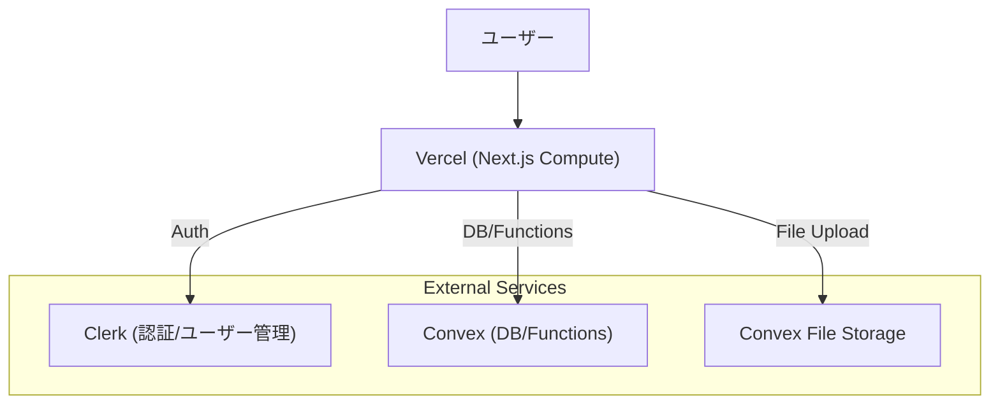

:::tip[現在の結論]
- Auth: Clerk（Organizations = RootTenant）
- DB / BaaS: Convex
- Storage: Convex File Storage（暫定）
- Deploy: Vercel（フロント） + Convex（バックエンドBaaS）

詳細は[Current Stack](/architecture/stack/current)を参照してください。
:::

## 1\. 主要4大クラウド比較と選定指針

各クラウドの「機能」だけでなく、「設計思想」と「採用すべきフェーズ」の比較分析。

| クラウド              | 設計思想と強み                                                                                                                                                                              | 弱点・懸念点                                                                                                                          | 今回の採用判断                                                                                               |
| :-------------------- | :------------------------------------------------------------------------------------------------------------------------------------------------------------------------------------------ | :------------------------------------------------------------------------------------------------------------------------------------ | :----------------------------------------------------------------------------------------------------------- |
| **AWS** (Amazon)      | **「DIYのデパート」**<br>・**圧倒的シェア:** ドキュメント、ライブラリ、エンジニア確保が容易。<br>・**網羅性:** ない機能はない。細かい制御が可能。<br>・**安定性:** インフラの信頼性が高い。 | ・**構築コスト:** 初期設定が複雑で、開発開始までに時間がかかる。<br>・**課金体系:** 複雑で、Egress（通信料）が高額になりがち。        | **【移行先の最終目標】**<br>PMF（製品が市場に適合）後、コスト最適化と統制のために利用する。                  |
| **GCP** (Google)      | **「データとコンテナ」**<br>・**Kubernetes (GKE):** コンテナ運用の完成度が最高峰。<br>・**データ分析:** BigQueryが強力。<br>・**NW:** 独自の光ファイバー網で高速。                          | ・**サポート:** エンタープライズ対応がAWS/Azureに比べると淡白。<br>・**突然の仕様変更:** 過去にサービス終了や仕様変更が散見される。   | **【今回は見送り】**<br>データ分析特化ではないため、AWSの汎用性を優先。                                      |
| **Azure** (Microsoft) | **「Entra ID (AD) と OpenAI」**<br>・**MS製品連携:** Office 365やActive Directoryとの統合。<br>・**AI:** OpenAI APIをセキュアに使える。                                                     | ・**独特な作法:** 管理画面や概念がWindows寄り。<br>・**OSS:** Linux系技術との親和性はAWS/GCPの方が歴史的に深い。                      | **【今回は見送り】**<br>特定のMS製品依存がない限り、Web系ではAWSが主流。                                     |
| **OCI** (Oracle)      | **「DB特化と低コスト」**<br>・**通信料:** Egressが圧倒的に安い（AWSの1/10以下）。<br>・**DB:** Oracle DBが最高性能で動く。                                                                  | ・**エコシステム:** AWS等に比べると周辺ツール（IaCなど）の情報が少ない。<br>・**開発者体験:** Webアプリ開発の容易さはVercel等に劣る。 | **【部分的採用もアリ】**<br>将来的に動画や大量データを扱う場合、ストレージ/通信部分のみOCIを使う戦略は有効。 |

-----

## 2\. 初期構成案：Vercel + Clerk + Convex (Modern BaaS)

開発スピード（Time to Market）を最大化しつつ、運用負荷を抑える現代的な構成です。

### アーキテクチャ図（概念）



### この構成のメリット

1.  **ゼロ・インフラ構築:** サーバー設定、ロードバランサー、SSL証明書管理が不要。`git push`でデプロイ完了。
2.  **B2B機能の即時実装:** ClerkのOrganizationsにより、企業境界を自前実装せず利用可能。
3.  **開発速度の最大化:** ConvexでDB/Functions/Realtimeを一体で扱える。

-----

## 3\. ベンダーロックイン回避のための「鉄の掟」

「Vercelは便利だが、Vercelから出られなくなる」事態を防ぐための技術選定基準です。
**AWSへ移行した後もコードを書き直さずに済む**よう、以下のルールに従う必要があります。

### ① コンピューティング (Compute)

  * **❌ NG:** `export const runtime = 'edge'`
      * **理由:** Vercel独自のEdge Runtimeに依存すると、AWS Lambdaやコンテナ（Node.js環境）で動かす際に互換性の問題が出る。
  * **✅ OK:** `export const runtime = 'nodejs'` (デフォルト)
      * **理由:** 標準的なNode.js環境であれば、AWS Fargate (Docker) でも Lambda でもそのまま動作する。

### ② ストレージ (Storage)

  * **❌ NG:** Vercel Blob / `vercel-storage` SDK

      * **理由:** Vercel独自のAPIであり、他社互換性がない。

  * **✅ OK:** Convex File Storage（暫定）
      * **理由:** アプリ内アップロードを最小構成で進められる。
      * **補足:** 大容量やCDN要件が出たら R2/S3 を併用する。

  * **R2/S3 併用時の実装例**

    ```typescript
    // 実装イメージ
    const s3 = new S3Client({
      region: "auto",
      endpoint: process.env.STORAGE_ENDPOINT, // ここを R2 から S3 のURLに変えるだけで移行完了
      // ...
    });
    ```

### ③ データベース (Database)

  * **❌ NG:** Vercel KV / Vercel Postgres SDK
      * **理由:** Vercelプラットフォームに強く統合されており、外部からの接続や移行が面倒。
  * **✅ OK:** Convex（BaaS）
      * **理由:** DB/Functionsを一体で扱い、テナント境界を関数側で強制できる。
      * **補足:** 退出を想定し、データモデルは標準的に保ち、export/import を計画しておく。

### ④ 非同期処理・Cron (Async/Job)

  * **❌ NG:** Vercel Cron Jobs
      * **理由:** `vercel.json` への記述が必要で、AWSにはその概念がない。
  * **✅ OK:** Inngest, Trigger.dev, または API Routeへの外部HTTPリクエスト
      * **理由:** 外部のジョブ管理SaaSを使うか、単純なHTTPエンドポイントとして実装しておけば、AWS EventBridge Scheduler等から叩く構成に容易に移行できる。

-----

## 4\. AWS移行ロードマップ (Exit Strategy)

サービスが成長し、以下の兆候が見えたらAWSへの移行（または併用）を開始します。

  * **トリガー:** Vercelの月額コストがAWSの試算を大幅に上回った時。または、エンタープライズ顧客から「専用IP」「閉域網接続」などを要求された時。

### Phase 1: アプリケーションのコンテナ化

Next.jsアプリケーションをDockerコンテナとして動作するようにします。

  * Next.jsの `output: 'standalone'` モードを使用。
  * `Dockerfile` を作成し、ローカルで `docker build/run` できる状態にする。
  * **この時点でVercel依存機能を使っていなければ、スムーズに完了します。**

### Phase 2: AWS環境の構築 (Compute移行)

Vercelの役割（Compute）のみをAWSに移します。DBやAuthはそのまま外部SaaSを使います。

  * **推奨構成:** AWS App Runner または Amazon ECS (Fargate)
  * **ロードバランサー:** ALB (Application Load Balancer) を配置。
  * **CDN:** CloudFront を前段に配置（Vercel Edge Networkの代わり）。

### Phase 3: インフラの切り替え (DNS Switch)

1.  AWS環境にDockerコンテナをデプロイ。
2.  ClerkやConvexの「許可されたドメイン/IP」にAWS環境を追加。
3.  DNS（Route53等）の設定を変更し、トラフィックをVercelからAWSへ向ける。
      * **ダウンタイムなしで移行可能。**

### Phase 4: 完全移行（必要な場合のみ）

コストや要件に応じて、周辺サービスもAWSネイティブに寄せます。

  * **Storage:** Convex File Storage を継続（要件が出たら R2/S3 併用）
  * **DB:** Convex を継続（退出する場合は export/import）
  * **Auth:** Clerk（無理にCognitoへ移行せず継続利用を推奨）

-----

### 結論

  * **現在:** **Vercel + Clerk + Convex** で開始し、PMFまでの速度を稼ぐ。
  * **開発:** Vercel独自機能に依存せず、境界ガードを関数側に集約する。
  * **未来:** 成長に合わせて **AWS App Runner / ECS** へコンテナを移す。

この方針であれば、リスクを最小限に抑えつつ、スタートアップとしての機動力を最大化できます。

:::tip[実装前の検討事項]
以下の点は実装前に確定する必要があります：
- Vercelの具体的なプラン選定（Hobby / Pro / Enterprise）
- Convexプロジェクトの初期設定（Auth連携 / テナント境界）
- ファイル保存の方針（Convex / R2併用の判断）
- AWS移行の具体的なタイミング判断基準
- コスト監視とアラート設定

これらは実装フェーズで詳細化される予定です。
:::
